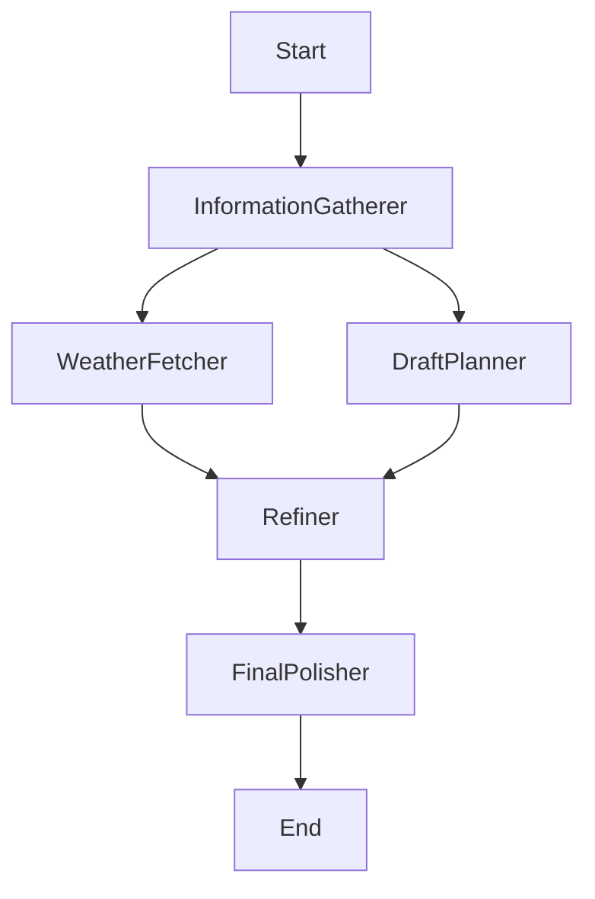

# LLM 增强方案调研与规划

## 1. 本地模型与动态配置 (Local Model & Configuration)

### 1.1 现状分析
当前 `src/llm/llm_manager.py` 中 `LlmManager` 类硬编码了 `OllamaLLM` 和默认模型 `deepseek-r1:7b`。这限制了用户使用其他本地模型或云端 API（如 OpenAI, DeepSeek API 等）的能力。

### 1.2 解决方案
我们需要将模型配置参数化，并提供 UI 供用户动态切换。

#### 1.2.1 配置参数结构
定义统一的配置结构（可通过 Streamlit `st.session_state` 传递）：
- `provider`: 模型提供商 (`ollama`, `openai_compatible`, `huggingface_local`)
- `base_url`: API 服务地址 (如 `http://localhost:11434` 或 `https://api.deepseek.com`)
- `model_name`: 模型名称 (如 `deepseek-r1:7b`, `gpt-4o`)
- `api_key`: 认证密钥 (可选)
- `temperature`: 生成温度
- `max_tokens`: 最大生成长度

#### 1.2.2 UI 交互设计
在 Streamlit 侧边栏（Sidebar）新增「LLM 设置」模块：
1.  **Provider 选择器**: 下拉菜单。
2.  **动态表单**: 根据 Provider 显示不同输入框。
    - 选 `Ollama`: 显示 Base URL, Model Name。
    - 选 `OpenAI Compatible`: 显示 Base URL, API Key, Model Name。
3.  **测试连接按钮**: 点击后尝试以此配置初始化 LLM 并发送简单 Hello 消息验证连通性。

#### 1.2.3 代码改造策略
重构 `LlmManager`：
```python
class LlmManager:
    def __init__(self, config: Dict[str, Any]):
        self.config = config
        self.llm = self._init_llm()

    def _init_llm(self):
        if self.config['provider'] == 'ollama':
            return OllamaLLM(...)
        elif self.config['provider'] == 'openai_compatible':
            return ChatOpenAI(...)
        # ...
```

## 2. 天气查询 Function Call

### 2.1 目标
在生成行程时，自动获取目的地未来几天的天气预报，作为规划参考（例如：雨天优先安排室内博物馆，晴天安排户外徒步）。

### 2.2 API 选型
推荐使用 **和风天气 (QWeather)** 或 **OpenWeatherMap**。
- **和风天气**: 国内数据准确，提供免费开发者版，支持按天预报。
- **OpenWeatherMap**: 国际通用，但免费版限制较多。

### 2.3 实现方案 (Function Calling)
利用 LangChain 的 Tool 机制。

#### 2.3.1 定义工具
```python
from langchain_core.tools import tool

@tool
def get_daily_weather(city: str, date: str) -> str:
    """
    查询指定城市指定日期的天气。
    Args:
        city: 城市名称 (如 "Beijing")
        date: 日期字符串 (如 "2023-10-01")
    Returns:
        天气描述字符串 (如 "晴转多云, 气温 15-25度")
    """
    # 实现 API 调用逻辑
    pass
```

#### 2.3.2 模型调用
- **支持 Function Call 的模型** (如 GPT-4, DeepSeek-V3): 使用 `llm.bind_tools([get_daily_weather])`。
- **不支持的本地小模型**:
    - 方案 A: 使用 **ReAct** 提示词策略。
    - 方案 B: 在 Prompt 中预先注入天气信息（Pre-fetching）。即在用户提问 "去北京玩3天" 后，先由代码提取地点和时间，并行调用天气 API，将结果作为 Context 放入 Prompt。这种方式对模型能力要求最低，最稳定。

**推荐策略**: 鉴于本地模型能力参差不齐，优先采用 **Context 注入 (Pre-fetching)** 方式，或者使用专门的 **Agent** 流程。

## 3. Multi-agent 开发模式 (LangGraph)

### 3.1 目标
将复杂的 "行程规划" 任务拆解为多个单一职责的 Agent，提高长链路任务的成功率和质量。

### 3.2 架构设计
基于 `LangGraph` 构建状态图 (StateGraph)。

#### 3.2.1 状态定义 (State)
```python
class PlanState(TypedDict):
    destination: str
    days: int
    user_preferences: str
    draft_plan: dict  # 初步行程
    weather_info: dict # 天气信息
    final_plan: dict  # 最终行程
    messages: List[BaseMessage]
```

#### 3.2.2 节点 (Nodes)
1.  **InformationGatherer**: 解析用户输入，提取目的地、时间。
2.  **WeatherFetcher**: 根据目的地和时间，调用天气 API 获取数据。
3.  **DraftPlanner**: 根据用户偏好生成初步行程（忽略天气）。
4.  **Refiner**: 结合 WeatherFetcher 的数据，检查 DraftPlanner 的行程。如果某天有雨且安排了户外活动，进行修改。
5.  **FinalPolisher**: 格式化输出为最终 JSON。

#### 3.2.3 工作流 (Workflow)


### 3.3 实施计划
1.  **基础设施**: 引入 `LangGraph` (已存在于依赖中)。
2.  **原子能力**: 封装 `WeatherTool` 和 `SearchTool`。
3.  **流程编排**: 先实现简单的 "Plan -> Review" 循环，再逐步加入天气和搜索增强。

## 4. MCP 工具化能力设计

### 4.1 MCP 在 TripNexus 中的定位
MCP（Model Context Protocol）可以看作是“标准化的 FunctionCall 工具层”，用于把外部系统（搜索、地图、机酒预订、日历等）以统一协议暴露给 LLM。对 TripNexus 来说，它的价值主要在于：
- 降低接入不同服务（SearXNG、天气、机票、酒店、地图）的心智负担。
- 让同一套 Multi-agent/对话流程可以在不同模型间复用（只要都支持 MCP）。
- 在安全层面更易做权限收敛和审计（每个 Tool 都有明确的参数与调用边界）。

### 4.2 典型 MCP 工具清单（按旅游场景）
- `weather.get_daily_forecast`：按城市+日期段返回多日天气（可落地到现有天气 FunctionCall 实现）。
- `poi.search`：基于 SearXNG + RAG，对“城市 + 玩法关键词”检索景点/餐厅/购物点，并返回结构化结果（名称、地址、评分、链接）。
- `transport.route_plan`：查询城市内/城市间的交通方案（地铁/公交/打车/高铁等），估算时间与价格。
- `booking.search_hotel`：按预算、星级、区域检索酒店，返回候选列表（可先做“只推荐不下单”）。
- `calendar.write_trip`：将最终行程写入用户日历（Google/Apple/Outlook），便于提醒与协同。

这些 Tool 都可以用 MCP 规范描述出来，后端由现有模块实现实际调用逻辑（如 `rag_main` + 爬虫，或第三方 API）。

### 4.3 与现有架构的对接方式
- 在后端集中维护一个 `tools_registry`，同时支持 MCP 客户端和 LangChain Tool 适配。
- Multi-agent 工作流中，Agent 不直接依赖某个具体 HTTP API，而是依赖抽象的 Tool 名称（如 `poi.search`）。
- 在模型层面：
  - 本地模型：主要通过“预获取数据 + Prompt 注入”的方式使用 MCP 结果。
  - 云端支持 Function Calling/MCP 的模型：直接让模型自己决定是否调用某个 MCP Tool。

## 5. FunctionCall 场景扩展

在天气查询之外，还可以把更多旅游相关能力抽象成 FunctionCall/MCP 工具，典型包括：

### 5.1 交通与时间估算
- 工具：`transport.estimate_travel_time`
- 输入：起点/终点（来自行程中的景点地址）、出行方式（步行/地铁/公交/自驾）、日期时间。
- 输出：预计耗时、推荐路线简介。
- 用途：在生成行程时，约束“单段路程不超过 X 分钟”，避免过度奔波。

### 5.2 预算与花费估算
- 工具：`budget.estimate_daily_cost`
- 输入：目的地、玩法偏好（餐饮/购物占比）、住宿档位（青旅/经济/高端）。
- 输出：每日大致花费区间 + 按项目拆分（吃、住、行、玩）。
- 用途：在行程生成阶段，根据预算上下限自动调节景点/餐厅/酒店档位。

### 5.3 POI 开放时间与票价
- 工具：`poi.get_opening_and_ticket`
- 输入：景点名称 + 城市。
- 输出：开放时间、闭馆日、门票价格与购票方式。
- 用途：避免生成“闭馆日去博物馆”“凌晨去景点”之类的错误行程。

### 5.4 汇率和语言辅助
- 工具：`currency.convert`：在预算和购物场景中做本币与目的地货币转换。
- 工具：`translate.phrase`：将关键句子翻译为目的地常用语言，生成“常用句卡片”。

这些工具可以组合进一次完整的行程生成流程：先用 FunctionCall 拉取硬约束（天气、开放时间、交通时间、预算），再让 LLM 在这些约束下生成或修正行程。

## 6. Agent 模式场景化设计

在第 3 节的基础 Multi-agent 方案上，可以结合实际旅游场景进一步细化角色和分工。

### 6.1 典型 Agent 角色
- `PreferenceCollector`：专注挖掘用户偏好（美食/自然/人文、早起晚睡、步行容忍度等），并写入用户画像。
- `DestinationResearcher`：基于 RAG 和 MCP 检索目的地信息（必玩景点、冷门玩法、避坑提示）。
- `RoutePlanner`：在时间、交通、开闭馆约束下排布每日路线。
- `WeatherAdjuster`：基于天气工具结果，动态调整某些天的户外/室内安排。
- `BudgetController`：监控总预算和日均预算，必要时给出“降级/升级方案”。
- `ExperiencePolisher`：把最终行程润色成可读性强的描述（含亮点摘要、小贴士）。

### 6.2 适配 TripNexus 现有模块
- 与 `src/rag/rag_main.py`：由 `DestinationResearcher` 触发 RAG 流程，获取攻略内容与实用信息。
- 与 `src/map/map_renderer.py`：`RoutePlanner` 生成的结构化行程（DailyPlan）直接作为地图渲染输入。
- 与对话上下文管理：`PreferenceCollector` 和 `ExperiencePolisher` 使用前端上下文管理模块提供的“核心实体 + 长期摘要”。

### 6.3 典型交互流程示例
1. 用户输入：“五一想和家人去东京玩 5 天，预算 1.5 万以内，别太赶。”
2. `PreferenceCollector`：抽取人数、关系（亲子/家庭）、预算、节奏偏好，更新用户画像。
3. `DestinationResearcher`：调用 RAG/MCP 获取东京亲子向景点、室内备选、热门商圈信息。
4. `RoutePlanner`：根据天数和区域聚类，规划每日游玩区域与景点顺序。
5. `WeatherAdjuster`：在临近出行时重新检查天气，对暴雨天调整为室内行程。
6. `BudgetController`：估算总花费，若超出预算给出替代方案或提醒。
7. `ExperiencePolisher`：输出结构化 JSON + 友好的文字说明，前端据此渲染聊天区和地图。

通过 MCP + FunctionCall + Multi-agent 的组合，TripNexus 可以从“单次行程生成工具”进化为“能够持续陪伴用户做规划、改行程、控预算、查攻略”的智能出行助手。
