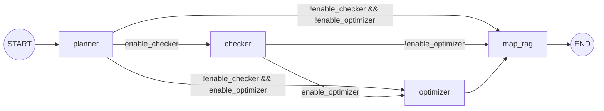

# v0.0.3（已完成）

目标：集成 FunctionCall/MCP + 初步 Agent 编排，打通端到端流程并完成性能与质量调优。

## 核心需求

1. 统一工具协议与调用入口
   - 统一 FunctionCall/MCP 的工具 Schema（name/description/params/returns/errors）
   - 工具注册与路由：本地工具与 MCP 工具走统一调用层
   - 最小工具集优先：天气、POI 搜索、地理编码，并定义失败回退策略

2. 多 Agent 流程编排（先顺序链路后多 Agent）
   - 默认链路：Planner → Weather/Constraint Checker → Budget Optimizer → Map/RAG Agent
   - 引入状态机与快照，支持取消、重试与中断恢复（Human-in-the-loop）

3. 流式输出与 UI 响应优化
   - LLM 流式输出支持 chunk/sequence 协议，并区分 start/delta/end 事件
   - Markdown 渲染节流 + 增量更新，避免频繁重绘
   - POI 按序准实时打点与分批渲染，支持按天分层显示

4. RAG 参考数据质量与长度控制
   - 多源检索 + 质量重排 + 证据预算控制
   - 片段级截断与摘要，避免上下文溢出与重复信息
   - 前端保留人工筛选入口作为兜底，支持来源可追溯
> 这里的压缩会引入新一轮LLM调用，需要优化速度和token消耗量！

5. 可视化
   - RAG 参考数据可视化展示，支持用户筛选与调整
   - 新增前端可视化界面，展示 Agent 流程与状态机
   - 支持用户自定义 Agent 配置与参数调整    

6. 性能与稳定性优化
   - 合并 多次LLM 调用，优化LLM调用时间
   - 支持云端模型与缓存
   - 增加多用户并发逻辑控制，增加I/O 并发的超时控制与熔断机制，输出统一错误规范

## 关键问题

- MCP 兼容性：对话中断或流式修改如何在状态机中回滚与恢复
- 流式输出：如何降低 UI 频繁重绘带来的抖动
- RAG 过长：如何引导用户介入与自动裁剪的平衡
- 高并发：asyncio 坑点规避
- **架构演进**：当前自研 Scheduler 逻辑复杂，v0.0.3 已集成 LangGraph 基础框架，实现了标准图编排模版，等待 v0.0.4 迁移

## 开发步骤

1. 工具协议与基础链路
   - 定义统一 Tool Schema（输入/输出 JSON、错误码）
   - 集成天气 + 地理编码 + POI 查询三个基础工具
   - 在 LLM 管理层封装工具调用入口

产出：可独立调用的工具注册表与最小可跑通链路

---------------------------------------------------------------------------------------

2. LangGraph 基础框架集成
   - 依赖集成：项目已完成 `langgraph` 核心依赖的引入与环境配置
   - **核心实现**：在 LangGraph 基础上实现了 `AgentState` 状态结构（涵盖 Plan/Task/Results）与 `StateGraph` 的基础流转逻辑（Planner -> Executor -> End），并完成了图编译与运行验证
   - **后续升级**：当前生产环境仍兼容自研 `Scheduler`，后续需将 `agent_loop.py` 的核心调度逻辑全面迁移至 StateGraph 运行时，并利用 `langgraph.checkpoint` 替换现有的快照存储以实现原生持久化
   - 价值：构建了标准化的图编排地基，为 v0.0.4 的架构平滑升级提供了可复用的模版与验证过的路径

产出：LangGraph 环境集成与标准编排模版代码

---------------------------------------------------------------------------------------

3. RAG 质量与长度控制
   - 引入 Evidence Budget：Summary / Body 分配上限
   - 抓取内容分块检索，保留 Top N 段落
   - 超长时自动摘要并允许前端筛选

产出：可配置的 Evidence 长度控制与去重策略

---------------------------------------------------------------------------------------

3. 流式输出与 POI 渲染
   - 输出 chunk/sequence 协议
     - 事件类型：start/delta/end，保证 sequence 单调递增
     - 兼容策略：流式失败时降级为一次性输出并补齐 end 事件
     - 解析规则：统一抽取 content_delta，兼容 str/content/dict
   - UI 渲染节流 + 分段冻结
     - 以段落为单位冻结已完成文本，活跃段单独渲染
     - 节流窗口 100-150ms，避免频繁重绘
     - end 事件汇总完整文本，供后续 JSON 解析
   - 地图 POI 分批打点与按天分层渲染
     - 每日生成 FeatureGroup，按天渲染路线与点位
     - batch_size 控制每次渲染的点位数量
     - 最后一次补发完整地图并落库以便复用

产出：流式输出协议与可控的 UI 渲染策略

---------------------------------------------------------------------------------------
> 本质就是将目前完成的固定工作流用 Agent节点的形式进行编排+状态存储（后续可恢复）+可视化处理（通过 EventBus/SnapshotStore 展示节点事件与快照时间线，方便定位 Planner/Checker/Optimizer/Map-RAG 的问题）

4. Agent 编排与状态机
   - 先实现顺序链路（Planner → Checker → Optimizer → Map/RAG）
     - Planner：复用行程生成，输出草案行程
     - Checker：调用天气/POI/地理编码，产出约束与补全
     - Optimizer：在预算与约束下修正草案
     - Map/RAG：渲染地图并注入Evidence Budget
   - 增加状态快照、取消与重试机制
     - 每步结束落快照，含 step、payload、日志与耗时
     - 取消与重试可从最近成功快照恢复
     - 失败记录错误类型并限制重试次数
   - 引入 Human-in-the-loop 中断处理策略
     - Draft 后确认继续或修改偏好
     - Checker 后展示硬约束提示并允许覆盖
   - **LangGraph 基础框架集成**
     - 已集成 `langgraph` 依赖，并在此基础上实现了 `AgentState` 状态定义与 `StateGraph` 基础流转逻辑的验证
     - 现状：生产环境核心调度仍沿用自研 `Scheduler` + `PlannerAgent` 进行 Plan-and-Execute 调度
     - 后续：需将核心调度逻辑全面迁移至 StateGraph 运行时，并升级为 `langgraph.checkpoint` 原生持久化
     - 价值：已构建标准化的图编排实现模版，明确了架构升级路径，为后续开发提供直接的代码参考
   - 同步建设 Agent 调试可视化（与状态机同源）
     - 流程视图：节点（Planner/Checker/Optimizer/Map/RAG）与状态（running/paused/failed/done）
     - 运行明细：每步耗时、输入输出摘要、错误与重试次数
     - 快照面板：按时间线列出快照并支持恢复到指定步骤
     - 事件总线：将节点更新/中断/错误/工具调用统一为事件流，供 UI 消费
     - 最小实现参考：/docs/技术难点/Agent框架调研.md 的“Streamlit 调试可视化面板（最小实现）”
     - 事件流自动刷新：运行/暂停阶段自动刷新，事件面板可展示 paused 状态
     - 状态面板总状态：显示 done/paused/failed/running 的总状态与节点状态
    - 状态面板节点状态：RAG 复核触发暂停时，Evidence 任务节点显示 paused
    - 调试页三列布局：左侧调试面板、中间状态面板、右侧行程面板
    - 状态面板顺序：运行状态 -> 计划预览 -> 事件流 -> 快照面板
    - 行程面板内容：行程地图 + 行程摘要独立展示
     - 结果展示来源：从 final_payload 或 SharedContext 渲染 map_html 与 summary
   - 支持用户自定义 Agent 配置与参数调整
     - 链路开关：选择是否启用 Checker/Optimizer/RAG
     - 约束参数：预算上限、行程密度、室内优先等可调项
     - 工具偏好：POI 结果数量、天气预报天数、检索 TopK

产出：可恢复的编排状态机、流程日志与调试可视化面板

---------------------------------------------------------------------------------------


5. RAG 证据可视化
   - RAG 参考数据可视化展示，支持用户筛选与调整
     - 证据结构：Summary/Body 分区展示，显示来源、置信度、时间戳与摘要文本
     - 交互能力：勾选保留、排序置顶、单条折叠/展开、手动编辑候选摘要
     - 预算提示：展示当前 Evidence Budget 使用量与超限预警

产出：可交互的 RAG 证据面板（可筛选/编辑/预算预警）

---------------------------------------------------------------------------------------


6. 性能与稳定性
   - 合并 LLM 调用，启用缓存与云端模型
     - 识别/抽取合并为一次调用，生成/修改保留一次调用
     - 对工具调用结果做缓存与 TTL 复用
     - 缓存命中与指标日志输出：tool_cache_hit/tool_cache_miss/tool_call_success
   - 多源搜索与抓取加入并发限制、超时与熔断
     - 搜索实例并发上限与失败回退策略
     - 抓取层域名级并发限制与全局超时
   - 全链路日志与可观测性补齐
     - 关键步骤打点：耗时、token、错误码
     - 统一错误规范与 UI 可视化提示

产出：关键链路性能指标与异常回退策略

补充：工具缓存与指标日志说明
- 缓存作用范围：仅工具调用（weather.get_daily / geo.geocode / poi.search），不包含 RAG 搜索抓取链路
- 缓存实现：内存 TTLCache，命中直接返回 ToolCallResult，未命中才执行工具
- 缓存 Key：工具名 + 规范化参数（移除空值、稳定序列化）
- 默认配置：TOOL_CACHE_TTL_SECONDS=300，TOOL_CACHE_MAX_SIZE=512
- 观测指标：tool_cache_hit/tool_cache_miss/tool_call_success/tool_call_failed
- 日志输出：MetricsRecorder.record 会输出 [Metrics] 事件到统一日志链路

核心位置：
- ToolRegistry 缓存入口：src/llm/tool_protocol.py
- TTLCache/Key 规范化：src/observability/cache.py
- 指标采集与日志：src/observability/metrics.py
- 默认配置项：src/config.py

---------------------------------------------------------------------------------------

## 开发：工具协议与基础链路

- 工具协议抽离为独立模块：src/llm/tool_protocol.py，包含 ToolSchema、ToolCallResult、ToolRegistry
- 工具实现下沉到独立模块：src/llm/tools/weather_tool.py、src/llm/tools/geo_tool.py、src/llm/tools/poi_tool.py
- 工具注册与调用统一入口：LlmManager 内部注入工具注册表，提供 list_tools、call_tool、decide_tool_call、call_tool_by_llm
- 最小工具集落地：
  - weather.get_daily：基于 Open-Meteo 获取城市级日天气
  - geo.geocode：基于 Nominatim 获取地址经纬度
  - poi.search：复用 SearXNG 搜索链路返回 POI 结果
- 可运行测试脚本：handlers/tool_test.py，可直接执行验证工具链路输出
 - LLM 调用方式：call_tool_by_llm 使用工具 Schema 生成路由决策并调用对应工具
```shell
# python3 handlers/tool_test.py
python handlers/tool_test.py
```

```python
from src.llm.llm_manager import LlmManager

llm = LlmManager()
result = llm.call_tool_by_llm("帮我查成都最近天气")
```

### 工具调用核心实现
- 路由决策： decide_tool_call
   用工具 Schema + 用户输入判断是否需要调用某个工具
- 实际调用： call_tool_by_llm
   基于上面决策直接调用工具并返回结果
- 直接调用： call_tool

### llm自动调用工具

- 行程生成前 ：用用户输入判断是否需要天气/POI/地理编码，调用后把结果注入 prompt
- 行程修改时 ：例如用户“添加景点”或“调整路线”，先调用 POI/地理编码工具补齐信息
- 对话理解时 ：识别出用户查询是“要查询天气/景点”时，直接走工具而不是生成行程
- 实现细节：
  - 工具路由由 decide_tool_call 完成：读取工具 Schema + 近 6 条上下文 + 用户输入，输出 needs_tool/tool_name/params
  - generate_trip 在 build_prompt 前调用 call_tool_by_llm，将成功结果以“工具结果：{...}”加入上下文
  - change_trip 在 general_conversation 场景优先尝试 call_tool_by_llm，成功则直接返回工具结果
  - 当检测为云端模型且支持 FunctionCall 时，call_tool_by_llm 优先走 FunctionCall；否则回退到工具路由方案

核心代码实现：

```python
# LlmManager.decide_tool_call：基于工具 Schema 与上下文判断是否需要工具
tools = self.list_tools()
normalized_context = self._normalize_tool_context(context)
context_text = "\n".join([f"{m['role']}: {m['content']}" for m in normalized_context])
prompt = f"""
可用工具列表（JSON）：
{json.dumps(tools, ensure_ascii=False)}
对话上下文：
{context_text or "无"}
用户输入：
{query}
"""
raw_response = self.analysis_llm.invoke(prompt)
clean_response = self.extract_json_from_string(
    raw_response.content if hasattr(raw_response, "content") else raw_response
)
data = json.loads(clean_response) if clean_response else {"needs_tool": False, "tool_name": "", "params": {}}
```

```python
# LlmManager.generate_trip：生成行程前先做工具预调用，把结果注入上下文
tool_query = self._build_tool_query(user_input=user_input, edit_cmd=edit_cmd)
if tool_query:
    tool_call = self.call_tool_by_llm(tool_query, self._normalize_tool_context(context))
    if tool_call.get("needs_tool") and tool_call.get("result"):
        result_payload = tool_call.get("result")
        if isinstance(result_payload, dict) and result_payload.get("success"):
            merged_context.append(f"工具结果：{json.dumps(result_payload, ensure_ascii=False)}")
prompt = self.build_prompt(user_input, merged_context, edit_cmd)
```

```python
# LlmManager.change_trip：对话型请求优先走工具查询，避免误触发行程生成
if intent_data["intent"] == "general_conversation":
    tool_call = self.call_tool_by_llm(query, context)
    if tool_call.get("needs_tool") and tool_call.get("result"):
        result_payload = tool_call.get("result")
        if isinstance(result_payload, dict) and result_payload.get("success"):
            return {
                "response": f"工具结果：{json.dumps(result_payload.get('data'), ensure_ascii=False)}",
                "trip_data": None,
                "intent": "tool_response"
            }
```

### 本地模型 / 云端模型检测与 FunctionCall 切换

核心思路：基于 provider 判断是否云端模型，同时检查模型实例是否具备 bind_tools 接口，从而启用 FunctionCall。

```python
# LlmManager._is_cloud_model：根据 provider 判定是否云端模型
if llm_role == "analysis":
    cfg = self._analysis_config
else:
    cfg = self._generation_config
provider = (cfg.get("provider") or "").lower()
return provider == "openai_compatible"
```

```python
# LlmManager._supports_function_call：检测模型实例是否支持 FunctionCall
return hasattr(self.analysis_llm, "bind_tools")
```

```python
# LlmManager.call_tool_by_llm：云端模型优先走 FunctionCall
if self._is_cloud_model("analysis") and self._supports_function_call(self.analysis_llm):
    function_call_result = self._call_tool_by_function_call(query, context)
    if not function_call_result.get("fallback"):
        return function_call_result
```

```python
# LlmManager._call_tool_by_function_call：解析 tool_calls 并执行工具
bound_llm = self.analysis_llm.bind_tools(tools)
response = bound_llm.invoke(prompt)
tool_calls = getattr(response, "tool_calls", None)
first_call = tool_calls[0]
tool_name = first_call.get("name")
params = first_call.get("args") or {}
result = self.call_tool(tool_name, params)
```

### FunctionCall 与当前工具调用的对比

> FunctionCall 的本质是： 模型负责“决定调用哪个工具 + 生成参数”，实际执行仍由宿主程序完成
>
> 模型本身不会直接联网或访问你的本地能力，所以仍然需要本地工具实现来执行

当前实现（工具路由 + 结果注入）与原生 FunctionCall 的差异与取舍：

**当前工具调用（工具路由 + 结果注入）**
- 优点：
  - 不依赖模型原生 FunctionCall 能力，适配本地小模型与 OpenAI 兼容模型
  - 工具调用链路完全可控，异常与降级策略由业务层统一处理
  - Schema 统一在 ToolRegistry，便于扩展 MCP/本地工具的统一入口
- 缺点：
  - 需要手动构造路由 Prompt，输出结构不稳定时需额外兜底
  - 工具结果是“文本注入”，缺乏模型原生的结构化 tool_call 约束
  - 需要业务层显式决定何时注入工具结果，流程耦合更高

**原生 FunctionCall**
- 本质说明：
  - 模型只负责“选择工具 + 生成参数”，不会直接访问网络或执行代码
  - 工具的实际执行仍由业务侧完成，因此最终一定会落到本地工具实现
  - FunctionCall 只是把“工具选择”从手写路由改成模型产出的结构化 tool_call
- 优点：
  - 模型层面生成结构化 tool_call，参数更稳定且可校验
  - 工具调用与回答生成天然解耦，减少“Prompt 注入”噪声
  - 更适合多工具编排与复杂调用链（模型可持续发起多轮调用）
- 缺点：
  - 依赖模型能力与 SDK 支持，本地模型不一定具备
  - 开发链路更依赖 SDK/工具协议版本，迁移成本更高
  - 对模型版本敏感，输出格式变动需要适配

**建议**
- 本地模型/稳定性优先：继续采用当前工具路由方案
- 云端模型/多工具编排：可逐步引入原生 FunctionCall 并保持统一 ToolSchema


--------

## 开发：RAG 质量与长度控制（联网检索数据的摘要数据形成，通过标题+摘要 + 正文内容检测长度进行压缩）

- Evidence Budget 拆分：Summary / Body 分别配置最大长度与 Top K
- 抓取正文分块向量检索，保留 Top N 段落
- 超长段落触发自动摘要，保留候选列表供前端筛选

> 也就是无论是Summary还是Body都得满足 选择items数量 + token限制两个条件，如果刚好处在中间（比如选择某一条数据刚好超过token数量，则启用压缩功能将这条数据压缩到token限制的长度）/ 单段 Body 最大长度超过限制token数量也启用压缩

产出：可配置的 Evidence 长度控制与去重策略

----------------------------------

概念说明：
- Summary：来自搜索结果摘要/标题的精简信息，用于快速覆盖多来源核心观点，成本低但信息密度有限
- Body：来自抓取正文的高相关段落（联网检索得到网页内容后存入向量库，然后从向量库中检索出高相关段落），用于补充细节与可引用内容，但长度更长、成本更高
- Evidence Budget：对 Summary/Body 设置硬上限，确保上下文不溢出，同时为前端保留可筛选候选

触发与获取规则：
- Summary：只要存在搜索结果，就构建 Summary；即使抓取失败也可作为回退证据
- Body：仅当抓取到正文内容时构建；抓取为空时不生成 Body（保持空列表）
- Summary 用于“覆盖面”，Body 用于“细节可信度”，二者共同组成最终上下文

----------------------------------

Summary 生成细节：
- 输入来源：quality_filter 后的搜索摘要与标题（filtered_results）
- 压缩方式：单条 Summary 按最大字符数截断，并按去重规则保留 Top K
- 去重策略：对“标题+摘要”归一化后去重，避免相同来源的重复描述

Body 获取细节：
- 输入来源：抓取正文后写入向量库，对 query 做相似度检索
- 段落选取：从检索候选中去重并筛掉过短段落，按 Top N 选取
- 过长处理：段落超过上限时触发自动摘要，确保不超预算

Summary/Body 参数含义：
- EVIDENCE_SUMMARY_MAX_CHARS：Summary 区总字符预算上限
- EVIDENCE_SUMMARY_TOP_K：Summary 区最多保留条数
- EVIDENCE_SUMMARY_ITEM_MAX_CHARS：单条 Summary 最大长度
- EVIDENCE_BODY_MAX_CHARS：Body 区总字符预算上限
- EVIDENCE_BODY_TOP_N：Body 区最多保留段落数
- EVIDENCE_BODY_CANDIDATE_K：Body 相似度检索候选数量
- EVIDENCE_CHUNK_MAX_CHARS：单段 Body 最大长度，超出触发自动摘要
- EVIDENCE_CHUNK_MIN_CHARS：单段 Body 最小长度，过短段落将被丢弃

示例输入/输出：

输入（用户问题）：
```
东京三日游攻略有哪些值得参考的行程安排？
```

输出（证据结构示例，已裁剪）：
```json
{
  "evidence": {
    "summary": {
      "items": [
        {"title": "东京旅行计划—为期五天的完美假期规划", "source": "https://www.gotokyo.org/...", "text": "东京旅行计划—为期五天的完美假期规划：涵盖行程建议与路线概览..."}
      ],
      "used_chars": 580,
      "budget_chars": 1200
    },
    "body": {
      "items": [
        {"title": "东京旅行计划—为期五天的完美假期规划", "source": "https://www.gotokyo.org/...", "text": "第1天建议：浅草—上野—秋叶原...（已裁剪）"}
      ],
      "used_chars": 2100,
      "budget_chars": 2400
    },
    "budget": {
      "summary_max_chars": 1200,
      "body_max_chars": 2400
    }
  }
}
```

核心实现：

```python
# Config: 证据预算与分块配置
RAG_CHUNK_SIZE = int(os.getenv("RAG_CHUNK_SIZE", "800"))
RAG_CHUNK_OVERLAP = int(os.getenv("RAG_CHUNK_OVERLAP", "160"))
EVIDENCE_SUMMARY_MAX_CHARS = int(os.getenv("EVIDENCE_SUMMARY_MAX_CHARS", "1200"))
EVIDENCE_BODY_MAX_CHARS = int(os.getenv("EVIDENCE_BODY_MAX_CHARS", "2400"))
EVIDENCE_SUMMARY_TOP_K = int(os.getenv("EVIDENCE_SUMMARY_TOP_K", "5"))
EVIDENCE_BODY_TOP_N = int(os.getenv("EVIDENCE_BODY_TOP_N", "6"))
EVIDENCE_BODY_CANDIDATE_K = int(os.getenv("EVIDENCE_BODY_CANDIDATE_K", "10"))
EVIDENCE_SUMMARY_ITEM_MAX_CHARS = int(os.getenv("EVIDENCE_SUMMARY_ITEM_MAX_CHARS", "280"))
EVIDENCE_CHUNK_MAX_CHARS = int(os.getenv("EVIDENCE_CHUNK_MAX_CHARS", "700"))
EVIDENCE_CHUNK_MIN_CHARS = int(os.getenv("EVIDENCE_CHUNK_MIN_CHARS", "80"))
```

```python
# 摘要区构建：去重 + Top K + 预算裁剪
summary_section = self._build_summary_section(filtered_results)
```

```python
# 正文区构建：分块检索 Top N + 预算裁剪 + 超长自动摘要
relevant_docs = self.vector_store.similarity_search(query, k=self.config.EVIDENCE_BODY_CANDIDATE_K)
body_section = self._build_body_section(relevant_docs)
context_text = self._build_context_text(summary_section, body_section)
```

```python
# 返回给前端的证据结构（支持前端筛选）
return {
  "evidence": {
    "summary": summary_section,
    "body": body_section,
    "budget": {
      "summary_max_chars": self.config.EVIDENCE_SUMMARY_MAX_CHARS,
      "body_max_chars": self.config.EVIDENCE_BODY_MAX_CHARS
    }
  }
}
```


## 开发：流式输出与 POI 渲染

### 1.流式输出协议（chunk/sequence）
统一协议结构：
```json
{
  "event": "start|delta|end",
  "sequence": 0,
  "message_id": "assistant_xxxxx",
  "content_delta": "增量文本",
  "is_final": false
}
```

- start：建立消息流起始
- delta：增量文本片段
- end：结束态

核心实现：`LlmManager.stream_llm_text` 作为薄封装委托给 `LlmStreamingAdapter.stream_llm_text` 调用模型 stream 输出，`LlmManager.build_stream_events_from_stream`/`LlmManager.build_stream_events` 分别委托给 `LlmStreamingAdapter.build_stream_events_from_stream`/`LlmStreamingAdapter.build_stream_events` 统一封装 start/delta/end 事件序列（后者仅用于非流式兜底）

核心方法与逻辑补充：
- `LlmStreamingAdapter.stream_llm_text`：优先调用模型原生 stream 产出增量文本；失败时降级为 invoke 并一次性输出，保证流式链路可用
- `LlmStreamingAdapter.extract_stream_delta`：统一不同模型 chunk 的增量提取规则，兼容 str / content / dict 等结构
- `LlmStreamingAdapter.build_stream_events_from_stream`/`LlmStreamingAdapter.build_stream_events`：将真实流式增量或一次性完整文本包装为 start/delta/end 事件，保持 sequence 单调递增
- `ChatStreamRenderer.render_stream_response`：消费统一事件流，拼接 full_text，并驱动前端流式渲染（支持真实流式 + 本地兜底两种模式）
- `LlmManager.parse_trip_from_response_text`：在流式完成后对 full_text 进行 JSON 清洗与解析，避免中途解析失败

### 2.UI 渲染节流 + 分段冻结
实现位置：`ChatStreamRenderer` + `UIManager.render_chat_interface`
策略：
- 增量文本按段落分割（以 `\n\n` 为边界），已完成段落进入“冻结区”
- 以 120ms 为刷新节流窗口，避免频繁重绘
- 渲染层只更新活跃段，冻结段保持不变

核心方法与逻辑补充：
- `ChatStreamRenderer.render_stream_response` 维护 `frozen_segments` + `active_segment` 双缓冲结构，并负责节流刷新
- 仅在 delta 事件追加文本，按空行分段并冻结已完成段落
- 命中节流窗口或 end 事件时才刷新 UI，降低重绘频率
- end 事件返回完整 `full_text`，供行程 JSON 解析或历史落库

伪代码示意（冻结段 + 活跃段 渲染流程）：

```python
def render_stream_response(base_messages, placeholder, events):
    frozen_segments = []      # 已完成段落列表
    active_segment = ""       # 当前正在增长的段落
    last_render_ts = now_ms() # 上次真正执行 UI 刷新的时间
    throttle_ms = 120

    full_text = ""

    for event in events:
        if event["event"] == "start":
            continue

        if event["event"] == "delta":
            delta = event["content_delta"] or ""
            if not delta:
                continue

            active_segment += delta

            while "\n\n" in active_segment:
                paragraph, rest = active_segment.split("\n\n", 1)
                if paragraph:
                    frozen_segments.append(paragraph)
                active_segment = rest

            if now_ms() - last_render_ts >= throttle_ms:
                html = build_chat_html(base_messages, frozen_segments, active_segment)
                placeholder.markdown(html, unsafe_allow_html=True)
                last_render_ts = now_ms()

        if event["event"] == "end":
            if active_segment:
                frozen_segments.append(active_segment)
                active_segment = ""

            html = build_chat_html(base_messages, frozen_segments, "")
            placeholder.markdown(html, unsafe_allow_html=True)

            full_text = "\n\n".join(frozen_segments)
            break

    return full_text
```

### 3.POI 分批打点与按天分层渲染
实现位置：`TripMap.render_map_batches` + `UIManager.render_main_interface`
- `render_map_batches` 分批生成地图 HTML（poi_batch 事件）并返回 `sequence/day/is_final`
- UI 按 250ms 间隔更新地图浮层，完成后保存最终 map_obj
- 地图层按“第X天”分组为 FeatureGroup，支持按天分层展示

核心方法与逻辑补充：
- `TripMap.render_map_batches`：按天创建 FeatureGroup，逐个 POI 解析坐标并累积到 day_layer
- 每达到 batch_size 输出一次中间 HTML，保证地图更新可控且不卡顿
- 当天剩余点位未满批次时补发一次渲染更新
- 同一天内绘制 PolyLine 路线，最终追加 LayerControl 并输出完整 map_obj
- `UIManager.render_main_interface`：消费 poi_batch 事件并以 250ms 间隔更新悬浮地图，最终落库 map_obj 以便复用


-------

## 开发：Agent 计划与执行循环

> 目标：Plan-and-Execute 最小闭环 + 事件/快照可视化，支持计划预览与确认执行。

- PlannerAgent：输出任务计划并做合法性校验，支持 SOP/LLM 两种来源。[agent_loop.py](file:///Users/wcbbcc/my-code/my_github/TripNexus/src/agent/agent_loop.py)
- Scheduler：按依赖拓扑产出并发批次，提供并发/速率/预算控制。[scheduler.py](file:///Users/wcbbcc/my-code/my_github/TripNexus/src/agent/scheduler.py)
- AgentExecutor：执行批次任务，写入 SharedContext，并生成 final_payload。[agent_loop.py](file:///Users/wcbbcc/my-code/my_github/TripNexus/src/agent/agent_loop.py)
- 事件总线与快照：EventBus 记录 batch_start/replan/error/loop_end；SnapshotStore 在批次结束时落快照。[event_bus.py](file:///Users/wcbbcc/my-code/my_github/TripNexus/src/agent/event_bus.py)
- Streamlit 调试面板：侧边栏支持“生成计划/确认执行/清空事件”，可调预算与工具偏好。[ui_manager.py](file:///Users/wcbbcc/my-code/my_github/TripNexus/src/frontend/ui_manager.py)

节点流转（顺序链路 + 可跳过）：
- 固定起点：START → planner
- planner → checker：enable_checker=True 且未 paused/cancelled/failed
- planner → optimizer：enable_checker=False 且 enable_optimizer=True 且未 paused/cancelled/failed
- planner → map_rag：enable_checker=False 且 enable_optimizer=False 且未 paused/cancelled/failed
- checker → optimizer：enable_optimizer=True 且未 paused/cancelled/failed
- checker → map_rag：enable_optimizer=False 且未 paused/cancelled/failed
- optimizer → map_rag：未 paused/cancelled/failed
- map_rag → END：链路完成
- 任意节点结束后：若命中 pause_at（planner/checker），则置 paused 并 stop；UI 通过“继续执行”从最近快照恢复

流转图（Mermaid）：

------------------

# 开发：RAG 证据可视化

## 产出

- 可交互的 RAG 证据面板（可筛选/编辑/预算预警）
- Summary / Body 分区展示：来源、置信度、时间戳、摘要文本
- 已实现要点：
  1. 显示 RAG 检索出的 Summary / Body 证据（分区展示）
  2. 用户可勾选 Summary / Body 证据并重新生成答案
  3. 用户可编辑证据摘要文本并重新生成答案
> 勾选/编辑影响的是“第二次生成回答”这一步；不会触发重新检索、重新抓取、重新向量检索或重排 URL（候选集合不变）

## 使用入口（Streamlit）

- 侧边栏 → Agent 调试
  - 勾选「启用 RAG」
  - 点击「运行 Agent」
  - 在面板中查看：
    - RAG 回答
    - RAG 证据面板（Summary/Body tabs）

## 交互能力

- 勾选保留：对候选证据条目进行勾选（用于预算统计/筛选展示）
- 排序置顶：对单条证据置顶，列表排序优先展示
- 单条折叠/展开：每条证据以折叠面板展示详情
- 手动编辑候选摘要：可直接编辑摘要文本（用于预算统计与内容修订）
- 预算提示：实时统计勾选条目文本字符数，超出 Budget 时给出预警
- 用户自选证据生成回答：基于用户勾选/编辑后的证据拼装上下文，点击按钮重新生成 RAG 回答

## 能力说明（是否“仅展示” vs “可让用户选择”）

- 不是仅展示：面板内支持对每条证据进行勾选保留、置顶排序、文本编辑，并可用“已选证据”重新生成回答。
- 当前选择的作用范围：
  - 会影响“基于用户选择生成回答”的结果（使用勾选+编辑后的文本作为参考信息）。
  - 不会反向影响检索/抓取/向量检索的候选集合（即：不会因为取消勾选而重新检索或重排 URL）。

## Evidence 数据结构（用于前端展示）

- evidence.summary / evidence.body：
  - items：管线默认选入上下文的证据列表
  - candidates：候选证据列表（面板优先展示，支持编辑/筛选/勾选）
  - used_chars：管线默认选入时的字符使用量
  - budget_chars：该分区字符预算上限
- 单条证据字段：
  - source：URL
  - engine：搜索源/引擎（如 searxng engine）
  - confidence/score：相关度/重排分数（0-1 时可视为置信度）
  - timestamp：发布时间（可能为空）
  - title/text：标题与摘要/正文片段

## 代码位置

- RAG 证据结构扩展（confidence/timestamp/engine 回填）：[rag_main.py](file:///Users/wcbbcc/my-code/my_github/TripNexus/src/rag/rag_main.py)
- Streamlit 证据面板渲染与交互状态：[ui_manager.py](file:///Users/wcbbcc/my-code/my_github/TripNexus/src/frontend/ui_manager.py)


------


# 开发：性能与稳定性

## 目前现状

- 意图识别与抽取： analyze_user_message 单独调用分析模型，返回 intent/parameters 等结构化数据，UI 侧先调用一次再进入业务分支✅
- 工具调用入口：统一走 ToolRegistry.call✅，当前无缓存❌
- 多源搜索：SearXNG 多实例顺序尝试，单请求超时 10s✅，无并发上限与熔断❌
- 抓取：ThreadPoolExecutor 并发抓取，默认 max_workers=5✅，无域名级并发与全局超时❌
- RAG 链路：搜索 → 过滤 → 抓取 → 向量检索，日志为 logger.info✅，未统一错误规范❌
- 观测：Agent 编排节点有耗时日志与事件流✅，但 LLM/工具层未统一标准化事件❌


## 1. 观测/缓存/并发/错误规范的独立模块

- 统一错误规范：src/observability/errors.py
  - ErrorCodes：统一错误码枚举（TOOL/SEARCH/CRAWL/RAG/LLM/UNEXPECTED）
  - build_error_payload：标准化错误结构（code/message/detail/retryable/source）
  - normalize_exception：从异常构造标准错误 payload，包含 traceback
- 统一缓存能力：src/observability/cache.py
  - TTLCache：固定 TTL + max_size 的内存缓存，返回 (value, age_ms)
  - build_tool_cache_key/normalize_tool_params：保证参数排序与空值规整，避免 cache miss
- 统一并发/熔断能力：src/observability/limits.py
  - CircuitBreaker：按实例 key 计数失败与冷却，避免连续访问故障实例
  - DomainConcurrencyLimiter：按 domain 控制并发信号量，避免抓取过载
- 统一指标采集：src/observability/metrics.py
  - MetricsRecorder：线程安全事件记录器（record/snapshot/clear）
  - get_global_recorder：全局指标记录器入口

### 核心实现片段

#### 错误规范（errors.py）
```python
class ErrorCodes:
    TOOL_NOT_FOUND = "TOOL_NOT_FOUND"
    TOOL_EXECUTION_ERROR = "TOOL_EXECUTION_ERROR"
    SEARCH_INSTANCE_FAILED = "SEARCH_INSTANCE_FAILED"
    SEARCH_TIMEOUT = "SEARCH_TIMEOUT"
    CRAWL_FAILED = "CRAWL_FAILED"
    CRAWL_TIMEOUT = "CRAWL_TIMEOUT"
    RAG_FAILED = "RAG_FAILED"
    LLM_FAILED = "LLM_FAILED"
    UNEXPECTED_ERROR = "UNEXPECTED_ERROR"
```
```python
def build_error_payload(
    code: str,
    message: str,
    detail: Optional[Dict[str, Any]] = None,
    retryable: bool = False,
    source: Optional[str] = None,
) -> Dict[str, Any]:
```
```python
def normalize_exception(
    exc: Exception,
    code: str = ErrorCodes.UNEXPECTED_ERROR,
    source: Optional[str] = None,
) -> Dict[str, Any]:
```

#### 缓存与 Key 规范化（cache.py）
```python
def normalize_tool_params(params: Dict[str, Any]) -> Dict[str, Any]:
```
```python
def build_tool_cache_key(tool_name: str, params: Dict[str, Any]) -> str:
```
```python
class TTLCache:
    def get(self, key: str) -> Tuple[Optional[Any], Optional[int]]:
    def set(self, key: str, value: Any) -> None:
```

#### 熔断与并发限制（limits.py）
```python
class CircuitBreaker:
    def allow(self, key: str) -> bool:
    def record_success(self, key: str) -> None:
    def record_failure(self, key: str) -> None:
```
```python
class DomainConcurrencyLimiter:
    def acquire(self, url: str, timeout: Optional[float] = None) -> bool:
    def release(self, url: str) -> None:
```

#### 指标采集器（metrics.py）
```python
class MetricsRecorder:
    def record(self, name: str, payload: Optional[Dict[str, Any]] = None) -> None:
    def snapshot(self) -> List[Dict[str, Any]]:
    def clear(self) -> None:
```
```python
def get_global_recorder() -> MetricsRecorder:
```

## 2. 工具/搜索/抓取/LLM 链路整合与缓存

### 工具调用（缓存 + 指标）
- 入口：src/llm/tool_protocol.py
- 核心流程：缓存命中直接返回，未命中记录指标并调用工具
```python
cache_key = build_tool_cache_key(name, params)
cached_result, age_ms = self.cache.get(cache_key)
if cached_result:
    self.metrics.record("tool_cache_hit", {"tool_name": name, "cache_key": cache_key, "age_ms": age_ms})
    return cached_result
self.metrics.record("tool_cache_miss", {"tool_name": name, "cache_key": cache_key})
```
```python
tool = self._tools.get(name)
if not tool:
    error = build_error_payload(code=ErrorCodes.TOOL_NOT_FOUND, message=f"Tool {name} not found", source="tool_registry")
    return ToolCallResult(tool_name=name, success=False, error=error)
result = tool["handler"](**safe_params)
tool_result = ToolCallResult(tool_name=name, success=True, data=result)
self._cache.set(cache_key, tool_result)
self._metrics.record("tool_call_success", {"tool": name})
return tool_result
```
```python
error = normalize_exception(e, code=ErrorCodes.TOOL_EXECUTION_ERROR, source="tool_registry")
tool_result = ToolCallResult(tool_name=name, success=False, error=error)
self._metrics.record("tool_call_failed", {"tool": name, "error": error.get("code")})
return tool_result
```

### 搜索稳定性（熔断 + 并发 + 指标）
- 入口：src/rag/network/multi_source_search.py
- 核心能力：
  - CircuitBreaker：对 searxng 实例失败进行熔断与冷却
  - ThreadPoolExecutor：并发请求多个实例，优先拿到可用结果
  - 指标记录：成功/失败与结果数
```python
self._circuit_breaker.record_failure(base_url)
self._metrics.record("search_instance_failed", {"base_url": base_url, "error": "empty_results"})
self._circuit_breaker.record_success(base_url)
self._metrics.record("search_instance_success", {"base_url": base_url, "results": len(processed_results)})
```
```python
filtered_urls = [u for u in candidate_urls if self._circuit_breaker.allow(u)]
if not filtered_urls:
    return self._search_duckduckgo_fallback(params.get("q") or "")
with ThreadPoolExecutor(max_workers=concurrency) as executor:
    for future in as_completed(future_to_url):
        if (time.time() - start_ts) > self.config.SEARCH_GLOBAL_TIMEOUT_SECONDS:
            self._metrics.record("search_timeout", {"scope": "global"})
            break
        results = future.result(timeout=self.config.SEARCH_INSTANCE_TIMEOUT_SECONDS)
        if results:
            return results
```

### 抓取稳定性（域名并发限制 + 指标）
- 入口：src/rag/network/crawler.py
- 核心能力：
  - DomainConcurrencyLimiter：同域名并发限制
  - 指标记录：抓取成功/失败与耗时
```python
elapsed_ms = int((time.time() - start_ts) * 1000)
self._metrics.record("crawl_complete", {"elapsed_ms": elapsed_ms, "results": len(results)})
```
```python
if not self._limiter.acquire(url, timeout=self.config.CRAWL_REQUEST_TIMEOUT_SECONDS):
    self._metrics.record("crawl_limited", {"url": url})
    return None
try:
    return self._fetch_single(url)
finally:
    self._limiter.release(url)
```
```python
if (time.time() - start_ts) > self.config.CRAWL_GLOBAL_TIMEOUT_SECONDS:
    self._metrics.record("crawl_timeout", {"scope": "global"})
    break
```

### LLM 调用（生成/意图/流式指标）
- 入口：src/llm/llm_manager.py
- 覆盖点：
  - analyze_user_message：start/success/error 指标
  - generate_trip：start/success/error 指标
  - stream_llm_text：stream start/end/error 指标与 output_len
```python
self._metrics.record("llm_analyze_start", {"prompt_len": len(analysis_prompt), "context_size": len(context or [])})
self._metrics.record("llm_generate_trip_success", {"attempt": attempt + 1, "elapsed_ms": int(cost * 1000), "output_len": len(str(response_text))})
self._metrics.record("llm_stream_end", {"role": llm_role, "elapsed_ms": elapsed_ms, "output_len": output_chars})
```
```python
self._metrics.record("llm_generate_trip_start", {"attempt": attempt + 1, "prompt_len": len(prompt)})
self._metrics.record("llm_generate_trip_error", {"attempt": attempt + 1, "elapsed_ms": int(cost * 1000), "error": error_payload})
```
```python
self._metrics.record("llm_stream_start", {"role": llm_role, "prompt_len": len(prompt)})
error_payload = normalize_exception(exc, code=ErrorCodes.LLM_FAILED, source="llm_stream")
self._metrics.record("llm_stream_error", {"role": llm_role, "error": error_payload})
```

## 3. 链路日志指标与 UI 错误提示

- LLM 错误规范接入：src/llm/llm_manager.py
  - normalize_exception + ErrorCodes.LLM_FAILED 统一错误 payload
  - 指标事件：llm_analyze_error / llm_generate_trip_error / llm_stream_error
- UI 错误提示统一：src/frontend/ui_manager.py
  - _handle_chat_error：统一异常渲染与指标记录
  - UI 指标：ui_chat_start / ui_chat_success / ui_chat_error
```python
error_payload = normalize_exception(error, code=ErrorCodes.UNEXPECTED_ERROR, source="ui_chat")
self._metrics.record("ui_chat_error", {"error": error_payload})
st.error(f"系统处理失败（{error_payload.get('code')}）：{error_payload.get('message')}")
```
```python
self._metrics.record("ui_chat_start", {"session_id": session_id, "prompt_len": len(prompt)})
self._metrics.record("ui_chat_success", {"session_id": session_id, "elapsed_ms": int(total_cost * 1000)})
```

## 代码位置

- 观测模块总入口：[observability/__init__.py](file:///Users/wcbbcc/my-code/my_github/TripNexus/src/observability/__init__.py)
- 错误规范：[errors.py](file:///Users/wcbbcc/my-code/my_github/TripNexus/src/observability/errors.py)
- TTL 缓存：[cache.py](file:///Users/wcbbcc/my-code/my_github/TripNexus/src/observability/cache.py)
- 熔断/并发限制：[limits.py](file:///Users/wcbbcc/my-code/my_github/TripNexus/src/observability/limits.py)
- 指标记录器：[metrics.py](file:///Users/wcbbcc/my-code/my_github/TripNexus/src/observability/metrics.py)
- 工具缓存与指标：[tool_protocol.py](file:///Users/wcbbcc/my-code/my_github/TripNexus/src/llm/tool_protocol.py)
- 搜索稳定性与指标：[multi_source_search.py](file:///Users/wcbbcc/my-code/my_github/TripNexus/src/rag/network/multi_source_search.py)
- 抓取稳定性与指标：[crawler.py](file:///Users/wcbbcc/my-code/my_github/TripNexus/src/rag/network/crawler.py)
- LLM 指标与错误规范：[llm_manager.py](file:///Users/wcbbcc/my-code/my_github/TripNexus/src/llm/llm_manager.py)
- UI 错误提示与指标：[ui_manager.py](file:///Users/wcbbcc/my-code/my_github/TripNexus/src/frontend/ui_manager.py)
